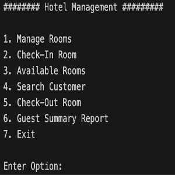

The **Hotel Management System** is a C++ console application designed to manage hotel operations, including room booking, check-in, check-out, and customer details. It provides functionality for hotel managers to easily add, search, delete, and manage room availability and reservations. The application also features customer management, offering a comprehensive overview of guest details and room status.

### Key Features:
- **Room Management**: Add, delete, and search rooms based on room number, type (AC/Non-AC), size, and comfort level.
- **Check-In/Check-Out**: Seamlessly manage guest check-in and check-out processes, with fields for customer details such as name, address, phone, and booking ID.
- **Available Room Search**: Easily search for available rooms based on their current status.
- **Guest Summary Report**: View a detailed summary of guests currently checked in, including their contact information and booking details.

### Technologies and Concepts Used:
- **C++**: The core logic is written in C++, focusing on object-oriented programming principles.
- **Object-Oriented Programming**: Use of `Customer` and `Room` classes to encapsulate customer and room data.
- **Static Variables**: The `Room` class uses a static array and static count to manage room data efficiently.

### Code Example
Here is a snippet showcasing the `Room` class and its associated methods, including adding and searching for rooms:

```cpp
class Room {
public:
    char type;
    char stype;
    char ac;
    int roomNumber;
    int rent;
    int status;
    static int count;
    static Room rooms[max];

    Room() : status(0) {}

    static Room addRoom(int);
    void searchRoom(int);
    void deleteRoom(int);
    static void displayRoom(const Room&);
};

int Room::count = 0;
Room Room::rooms[max];

Room Room::addRoom(int rno) {
    Room room;
    room.roomNumber = rno;
    std::cout << "\nType AC/Non-AC (A/N) : ";
    std::cin >> room.ac;
    std::cout << "\nType Comfort (S/N) : ";
    std::cin >> room.type;
    std::cout << "\nType Size (B/S) : ";
    std::cin >> room.stype;
    std::cout << "\nDaily Rent : ";
    std::cin >> room.rent;
    ++Room::count;
    Room::rooms[Room::count - 1] = room;
    std::cout << "\nRoom Added Successfully!";
    return room;
}

void Room::searchRoom(int rno) {
    int i, found = 0;
    for (i = 0; i < Room::count; i++) {
        if (Room::rooms[i].roomNumber == rno) {
            found = 1;
            break;
        }
    }
    if (found == 1) {
        std::cout << "Room Details\n";
        if (Room::rooms[i].status == 1) {
            std::cout << "\nRoom is Reserved";
        } else {
            std::cout << "\nRoom is available";
        }
        displayRoom(Room::rooms[i]);
    } else {
        std::cout << "\nRoom not found";
    }
}
