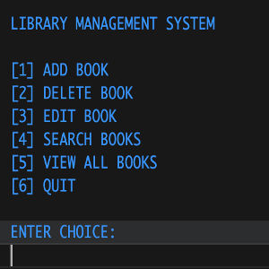

The **Library Management System** is a C++ console application that simulates the management of a library's book collection. It allows users to perform operations such as adding new books, editing book information, deleting books, and searching for books by title. The project uses object-oriented programming principles with classes for `Book`, `Fiction`, and `NonFiction`.

### Key Features:
- **Add Book**: Add books as either fiction or non-fiction, including details like title, author, edition, publisher, and more.
- **Edit Book**: Modify details of existing books by searching via ISBN.
- **Delete Book**: Remove a book from the collection using its ISBN.
- **Search Books**: Search books by their title.
- **View All Books**: Display all books currently in the library.

### Technologies and Concepts Used:
- **C++**: For building the core application and managing book objects.
- **Object-Oriented Programming**: Implementation of base class `Book` and derived classes `Fiction` and `NonFiction`.

Here is a snippet from the code showing the implementation of the `Book` class and its derived classes `Fiction` and `NonFiction`:

```cpp
#include <iostream>
#include <string>

class Book {
protected:
  int isbn;
  std::string title;
  std::string author;
  int edition;
  std::string publisher;

public:
  Book(int isbn, const std::string &title, const std::string &author,
       int edition, const std::string &publisher)
      : isbn(isbn), title(title), author(author), edition(edition),
        publisher(publisher) {}
  
  virtual void display() const {
    std::cout << "ISBN: " << isbn << "\nTitle: " << title
              << "\nAuthor: " << author << "\nEdition: " << edition
              << "\nPublisher: " << publisher << std::endl;
  }
};

class Fiction : public Book {
  std::string genre;

public:
  Fiction(int isbn, const std::string &title, const std::string &author,
          int edition, const std::string &publisher, const std::string &genre)
      : Book(isbn, title, author, edition, publisher), genre(genre) {}

  void display() const override {
    Book::display();
    std::cout << "Genre: " << genre << std::endl;
  }
};

class NonFiction : public Book {
  std::string subject;

public:
  NonFiction(int isbn, const std::string &title, const std::string &author,
             int edition, const std::string &publisher,
             const std::string &subject)
      : Book(isbn, title, author, edition, publisher), subject(subject) {}

  void display() const override {
    Book::display();
    std::cout << "Subject: " << subject << std::endl;
  }
};
